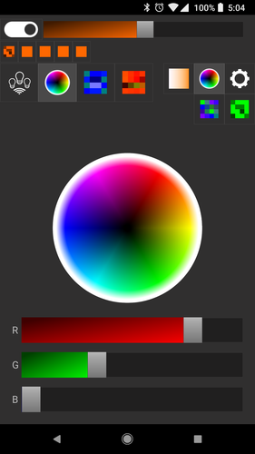
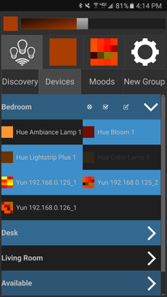
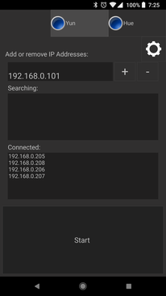

# Corluma

Corluma is a cross-platform GUI designed to control Philips Hue lights, Corsair RGB Keyboards, and arduino sketches from the [ArduCor project](https://github.com/timsee/ArduCor). It supports Windows, Linux, Mac OS X, Android, and iOS. It requires on Qt5.2 or later and C++11.

  

## <a name="documentation">Documentation</a>

*  [Frontend Overview](https://timsee.github.io/Corluma/html/front_overview.html)
*  [Backend Overview](https://timsee.github.io/Corluma/html/backend_overview.html)
*  [Mobile Support](docs/markdown/mobile.md)
*  [Communication With Hardware](docs/markdown/hardwarecomm.md)
*  [Changelog](CHANGELOG.md)
*  [Credits](docs/markdown/credits.md)
