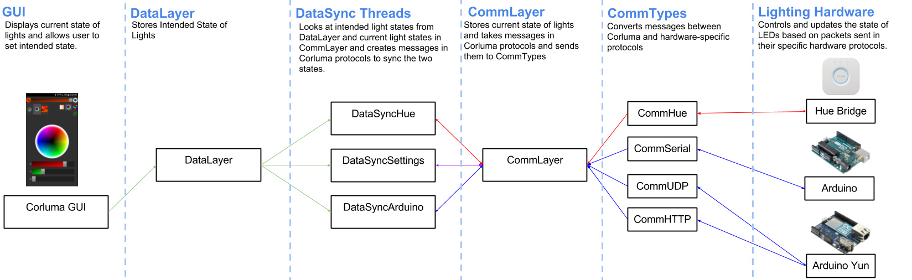

### <a name="hardware-comm">Communication With Hardware</a>

In order to make it easier to integrate different hardware with a variety of protocols into one system, there are a couple of layers of abstraction that all communication packets go through. The core systems used in commuincation are the `CommLayer`, the `DataLayer`, and the `DataSyncThreads`. The `DataLayer` holds all the users desired states for lights. If the user presses the off button for one light, and changes another RGB light to orange, both of these desired states are stored in the `DataLayer`. The `CommLayer` stores the actual states of the various lights. So if a Phillips Bridge updates that a light is currently as green as it can be, this data is stored in the CommLayer. This system is also responsible for converting messages from Corluma's protocols to other protocols such as the Phillips protocol. `DataSync Threads` are threads that wake up when the `DataLayer` changes and check the `DataLayer` against the `CommLayer` and, when necessary, it constructs packets in Corluma's protocols that are given to the `CommLayer` to send to the various lighting hardware. `DataSync Threads` either go to sleep when the states in the `CommLayer` exactly match the states in the `DataLayer` or when they encounter hardware failure for a light (for example, the light is off and cannot be reached). 

